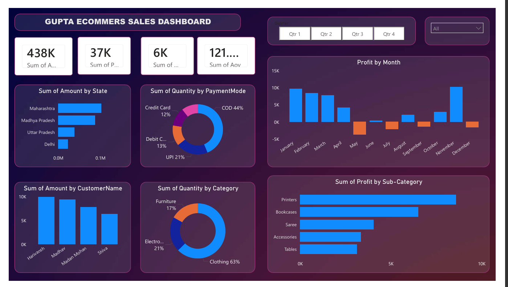

# sales-performance-dashboard-powerbi
Interactive Sales Dashboard built in Power BI using sales and order data to analyze revenue, profit, customer behavior, and business performance through dynamic visualizations and KPIs.

# Sales Performance Dashboard - Power BI

Interactive Sales Dashboard built in Power BI to analyze revenue, profit, customer behavior, and business performance.

## Overview

This project is an interactive Power BI dashboard designed to analyze and visualize e-commerce sales data. The dashboard helps stakeholders monitor revenue, profit, order quantity, customer performance, payment methods, and product category trends.

## Key Metrics

- Total Sales: 438K
- Total Profit: 37K
- Total Quantity Sold: 6K
- Average Order Value: 121K+

### Sales Analysis
- Sales performance by state
- Customer-wise sales contribution
- Monthly profit trend analysis

### Product Insights
- Category-wise quantity distribution
- Sub-category profit analysis
- Identification of top-performing products

### Customer Insights
- Top customers by sales value
- Customer purchasing behavior analysis

### Payment Analysis
- Distribution of payment methods
- COD, UPI, Debit Card, and Credit Card usage trends

### Interactive Filters
- Quarterly performance filtering
- Dynamic dashboard interaction

## Tools & Technologies

- Power BI
- DAX
- Data Modeling
- Data Visualization
- CSV Datasets

## Business Value

The dashboard enables businesses to:
- Track sales and profitability
- Identify profitable product categories
- Understand customer purchasing behavior
- Monitor payment preferences
- Support strategic decision-making
  
## Project Objective

The objective of this project is to analyze e-commerce sales performance and generate actionable business insights through interactive visualizations and KPI tracking.

## Key Business Insights

- Maharashtra generated the highest sales revenue.
- COD was the most commonly used payment method.
- Clothing contributed the highest quantity sold among categories.
- Printers generated the highest profit among sub-categories.
- Monthly profits showed fluctuations with strong performance in November.
## Author

Virat Thakran
